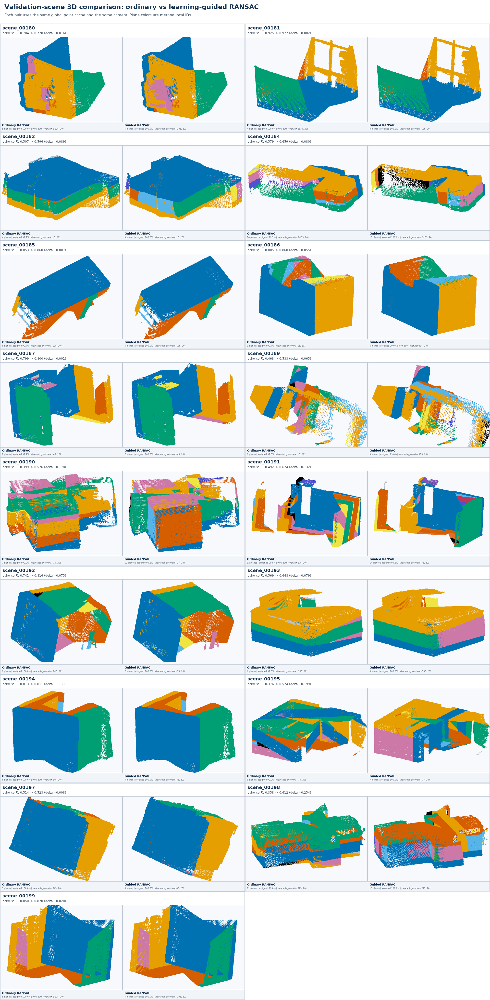

# LightRecon3D阶段进展汇报

老师好，下面汇报这段时间完成的工作和实验结果。

## 一、近期进展

本周完成了17场景批量实验、失败场景恢复和三维结果汇总。项目流程已经固定：每个场景输入5张无给定位姿的室内图像，使用DUSt3R完成点图预测和全局对齐，随后运行平面support预测、平面实例提取和结构线提升，最后导出NPZ、PLY、指标文件和三维对比图。

跨视图support映射也已经完成。二维区域不再按照数组位置直接合并，每个点通过`(alignment_view_index, x, y)`映射到DUSt3R全局点云。运行记录保存来源视图、像素位置、缓存路径和SHA256。由此可以确认普通RANSAC和改进方法使用相同的有序点云，方法差异不会混入重复全局对齐带来的变化。

第一次批处理完成14个场景，`scene_00190`、`scene_00194`和`scene_00197`因服务器初始化、平台连接和CUDA设备异常中断。恢复程序只重跑这3个场景，并校验原场景索引、checkpoint、DUSt3R权重和冻结配置。恢复后17个场景全部通过，原始失败日志和恢复来源仍然保留。

## 二、方法调整

早期方案直接使用Stage1和Stage2输出的support身份合并平面。实验中出现了跨视图重复记录、标签冲突和漏检。直接合并容易把相邻结构串在一起；删除冲突点虽然提高了部分条件指标，但full-cache coverage接近零，不能作为最终结果。

最终方案使用Stage1和Stage2的support生成并排序平面候选，再在完整全局点云上完成共识检验、置信度加权重拟合和连通域划分。未被学习候选解释的点继续交给后备RANSAC。Stage1在80条固定图像对记录上的precision为`0.883814`，recall为`0.629410`。recall偏低，直接采用预测标签会漏掉较多平面区域，因此support只用于候选生成，最终内点和参数仍由三维几何确定。

候选排序同时考虑未分配全局点中的内点数和对应support内点数。候选被接受后，系统使用全部全局内点重新拟合，不把预测support限制为最终支撑范围。平面距离内点再按三维邻域划分连通分量，避免把空间上分离但近似共面的区域直接输出成一个无限平面。

## 三、实验设置与结果

实验使用17个Structured3D独立验证场景，每个场景保留一个5视图组。普通RANSAC和support引导RANSAC读取相同的DUSt3R全局缓存。场景选择、模型权重、图像顺序和方法阈值在批量运行前冻结，没有针对单个场景调参。

评价脚本把Structured3D平面标注映射到同一批全局点，普通RANSAC、引导RANSAC和GT使用相同的点顺序。指标同时记录F1、matched IoU、overmerge、点分配率和GT coverage，避免通过删除困难点获得较高分数。8场景冻结确认实验中，引导方法的GT coverage中位数为`0.999828`，因此主实验没有采用删除冲突点的结果。

| 指标 | 普通RANSAC | support引导RANSAC | 变化 |
|---|---:|---:|---:|
| 平面分组平均F1 | 0.632406 | 0.706348 | +0.073942 |
| 平均matched IoU | 0.489136 | 0.678036 | +0.188899 |
| 平均overmerge excess | 2.882353 | 1.470588 | -1.411765 |
| 平均VOI（越低越好） | 1.493965 | 1.172062 | -0.321904 |
| 平均Rand Index | 0.789837 | 0.834620 | +0.044783 |
| 平均Segmentation Covering | 0.561563 | 0.658550 | +0.096987 |
| 平面提取阶段平均耗时 | 19.826422秒 | 17.892183秒 | -1.934239秒 |

17个场景中有16个F1提高，中位配对增益为`+0.064718`。`scene_00194`是唯一负例，F1约从`0.813`降到`0.811`。16胜1负的精确双侧符号检验为`p=0.000275`。VOI、Rand Index和Segmentation Covering与F1结论方向一致。实验支持提高平面分组F1、matched IoU并减少overmerge，但数据均来自Structured3D，不能据此声称对真实室内图像普遍有效，也不能声称达到公开数据集领先水平。

5视图DUSt3R推理加300步全局对齐的中位耗时为`9.123秒`。Stage1约有7991万参数，checkpoint接近305 MiB，不能描述成小模型或轻量预测头。17场景中平面提取阶段的平均时间下降，但早期冻结效率门槛没有通过，因此速度提升不作为结论。

## 四、可视化结果

17场景总览图对比了普通RANSAC和support引导RANSAC。两种方法使用相同点云和观察视角，实例颜色由各自结果独立生成。`scene_00186`的F1提高`0.055`；`scene_00195`从`0.376`提高到`0.574`；`scene_00198`从`0.358`提高到`0.612`。这些场景中，相邻结构被合成一个平面的情况有所减少。`scene_00181`、`scene_00187`和`scene_00197`变化较小。`scene_00194`保留为边界案例，不只展示增益较大的场景。

图1 17个Structured3D验证场景的三维平面实例结果。每个场景左侧为普通RANSAC，右侧为support引导RANSAC。

现有图展示的是带平面实例分组的结构化点云和有界平面支撑，不是水密网格，也没有补全遮挡区域。总览图用于展示全部实验，正式报告将选择少量场景放大，并使用GT匹配后的统一颜色绘制普通RANSAC、引导RANSAC和GT对比。

## 五、失败实验和存在的问题

直接合并support没有通过最终对比，删除冲突点导致覆盖率崩塌。平面损失反馈实验降低了plane loss，但注册后的结构指标没有稳定改善，因此没有继续扩展。结构线检测和三维提升已经跑通，可以输出二维叠加图和三维线段，但结构线尚未进入平面优化，也没有证据表明它提高了平面指标。

项目仍依赖DUSt3R的全局对齐质量。点图出现双层、尺度漂移或错误相机关系时，support引导只能调整候选顺序，无法修复底层几何。Stage1 recall偏低，后备RANSAC补充漏检区域时仍可能重新引入过合并。17个合成场景也不足以替代真实图像实验。

## 六、下一步安排

下一步先完成科研实践报告，不重新训练基础模型。报告以17场景合并结果为最终定量实验，正文依次整理问题背景、方法调整、实验协议、主结果、消融实验和局限。17场景总览图直接放入阶段报告，另外选择`scene_00186`、`scene_00195`和`scene_00198`制作放大对比图，并加入`scene_00194`负例。GT统一着色图完成后，用它替换方法独立配色的局部结果图。

报告中会保留普通RANSAC对比表、VOI/RI/SC、Stage1前端结果和失败实验，不再只用文字概括。第一次14场景运行的服务器故障放在复现记录中，直接合并support、删除冲突点和平面损失反馈放在消融与失败分析中。结构线只作为附加输出展示，不写成提高平面精度的实验结论。

论文对比单独开展。第一条外部基线选择Plane-DUSt3R，先按其官方Structured3D房间布局协议复现并单独成表，再判断官方输出能否映射到与本方法相同的全局点缓存上计算VOI/RI/SC。它默认使用`perspective/full`图像，而当前17场景结果使用`perspective/empty`，因此在完成输入和输出适配前不会把两组数字直接排成同一排行榜。随后再根据可复现性决定是否增加PLANA3R等无位姿方法；AirPlanes和PlanarSplatting属于已知位姿、ScanNet协议，只作为另一条参考轨道。
